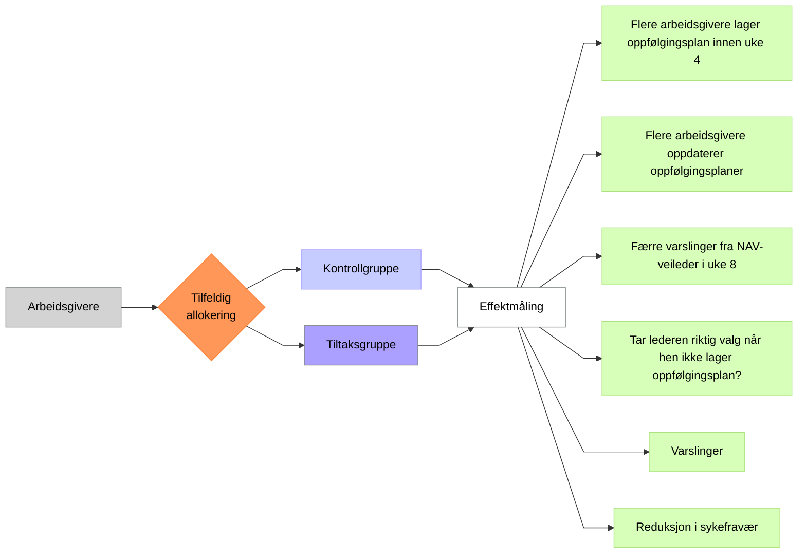

# Målinger tiltakspakke 1

Her kommer en beskrivelse av **målinger** for tiltakspakke 1. Først forklarer vi det eksperimentelt design vi har valgt, og hvordan vi forventer at dataen ser ut når den har kommet inn. Deretter beskriver vi de ulike effektmålene. For hvert effektmål forklarer vi hva som må være på plass for å måle det.

## Eksperimentelt design

Vi har designet eksperimentet som en A/B-test med to armer: en kontrollgruppe som følger den vanlige brukerreisen, og en tiltaksgruppe som følger en brukerreise med flere dultetiltak. Vi randomiserer på arbeidsgivernivå, og fordi randomiseringsenhteten er arbeidsgivere, er det der vi evaluerer effekten av tiltakspakken. Det gjør vi fordi vi vil gi hver arbeidsgiver de samme tiltakene — både for å hindre «treatment diffusion» og for å sikre at ledere får samme tiltak. Vi fordeler på underenhet av en arbeidsgiver, ikke overenhet. Figuren under viser designet:

*Figure 1: Randomisert kontrollert design: arbeidsgivere allokeres tilfeldig til kontroll- og tiltaksgruppe, og effekt måles ved å sammenligne gruppene.*

På grunn av det valgte eksperimentdesignet får vi data som henger sammen i nivåer, slik tabellen under viser. Hver arbeidsgiver har flere ledere, og hver leder følger opp flere sykmeldte. For hver oppfølging registrerer vi én måling, for eksempel om lederen laget en oppfølgingsplan eller ikke. Denne type datastruktur kalles en nøstet datastruktur.

Poenget er at målingene ikke er uavhengige av hverandre. To ledere hos samme arbeidsgiver jobber under de samme rutinene og den samme kulturen, så vi forventer at deres målinger ligner mer på hverandre enn på målinger fra en helt annen arbeidsgiver. Hvis én arbeidsgiver er god på sykefraværsoppfølging, vil de fleste lederne der gjøre det bra. Og motsatt.

Dette må vi ta hensyn til når vi regner ut effekten av tiltaket. Hvis vi behandler hver måling som om den var helt for seg selv, kommer vi til å tro at vi har mer sikker informasjon enn vi faktisk har, og da risikerer vi å overdrive hvor godt tiltaket virker. Derfor bruker vi en analysemetode som tar høyde for at målingene er gruppert under ledere og arbeidsgivere.

**Tabell 1: Nøstet datastruktur: hver måling hører til en leder, og hver leder hører til en arbeidsgiver.**

| Arbeidsgiver | Nærmeste leder | Observasjon (Måling) |
| --- | --- | --- |
| AG-01 | Leder A | obs 1 |
| AG-01 | Leder A | obs 2 |
| AG-01 | Leder B | obs 3 |
| AG-01 | Leder B | obs 4 |
| AG-02 | Leder C | obs 5 |
| AG-02 | Leder C | obs 6 |
| AG-02 | Leder C | obs 7 |
| AG-02 | Leder C | obs 8 |

## Målinger

### Effektmål 1: Flere arbeidsgivere lager oppfølgingsplan innen uke 4

Et av hovedmålene i tiltakspakke 1 er at flere skal lage en oppfølgingsplan *innen uke 4*. For å måle dette trenger vi å registrere om en leder faktisk har laget en plan eller ikke. For å få til dette må vi vite hvor lenge den ansatte har vært sykmeldt. Derfor må vi lage en tidsvariabel som teller uker fra sykmeldingen startet. Den første uken settes til 0, og så teller vi oppover: 1, 2, 3, 4. Tallet 3 svarer altså til uke 4, og tallet 4 svarer til uke 5.

I registreringen gjør vi det enkelt: lederen får «ja» hvis planen er laget, og «nei» hvis den ikke er det. Når vi senere skal analysere tallene, gjør vi om disse til 1 og 0, hvor 1 betyr «ja» og 0 betyr «nei». Det er fordi de fleste analysemetoder regner med tall, ikke ord.

Notis: Dersom vi ønsker kan vi også registrere når (uken) de laget en oppfølgingsplan. Registrer “nei” hvis ikke oppfølgingsplanen er laget denne uken og “ja” hvis den er laget

### Effektmål 2: Flere arbeidsgivere oppdaterer oppfølgingsplaner

Et annet mål kan være at lederen lager en ny oppfølgingsplan etter at den første er på plass. For å måle det må vi først vite at den sykmeldte allerede har en oppfølgingsplan. Deretter registrerer vi om lederen lager en ny plan. Vi gjør det på samme måte som i effektmål 1: «ja» hvis lederen lager en ny plan, «nei» hvis ikke, og så gjør vi om svarene til 1 og 0 før analysen.

Notis: Dette kan potensielt bli en utfordrende måling, med mindre vi setter en tydelig stoppdato for når lederen bør ha oppdatert planen. Vi måler heller ikke oppdatert plan, men om lederen lager en ny plan.

### Effektmål 3: Færre varslinger fra NAV-veileder i uke 8

Et annet effektmål er om vi klarer å redusere antall varsler Nav sender ut i uke 8. Her ønsker vi at tiltaksgruppen har færre varsler enn kontrollgruppen. For å måle dette trenger vi å registrere om en sykmeldt har fått et varsel fra Nav eller ikke. Vi bruker den samme uketellingen som i Effektmål 1, der den første uken er 0. Uke 8 svarer da til tallet 7. Vi registrerer for hver uke om det er sendt et varsel. På den måten ser vi både om det kom et varsel i uke 8, og hvor mange varsler hver person har fått underveis.

I registreringen gjør vi det enkelt, på samme måte som i Effektmål 1: den sykmeldte får «ja» hvis Nav har sendt ut et varsel den uken, og «nei» hvis de ikke har gjort det. Når vi senere skal analysere tallene, gjør vi om disse til 1 og 0, hvor 1 betyr «ja» og 0 betyr «nei». Det er fordi de fleste analysemetoder regner med tall, ikke ord.

Notis: Det er én ting å være klar over. Variabelen måler om Nav faktisk har sendt et varsel, ikke om det burde vært sendt et varsel. Nav sender ikke alltid varsel selv når vilkårene er oppfylt. Et «nei» kan derfor bety to ting: at varsel ikke var aktuelt, eller at varsel var aktuelt men ikke ble sendt. Så lenge dette rammer tiltaksgruppen og kontrollgruppen likt, påvirker det ikke sammenligningen mellom gruppene. Vi måler effekten på faktiske varsler, og det er det vi er ute etter.

### Effektmål 4: Tar lederen riktig valg når hen ikke lager oppfølgingsplan?

Vi vil ikke bare studere dem som lager oppfølgingsplaner. Det er også interessant å se på dem som lar være. Tar disse lederne det riktige valget?

Når en leder velger å ikke lage en plan, kan vi se på hvorfor, og om valget viste seg å være godt. Et eksempel: En leder lar være å lage plan fordi hen tror fraværet blir kortvarig. Så ser vi i ettertid at den ansatte var sykmeldt lenge. Da kan vi spørre om lederen burde ha laget planen likevel.

Notis: Dette krever mer arbeid, men er en interessant tilleggsanalyse. Vi må også drøfte onsdag 17. juni om vi har lov til å måle dette.

### Effektmål 5: Varslinger

Her anbefaler vi at dere setter opp ulike dashboard-visninger for å forstå hvordan ledere og sykmeldte velger. Noen forslag:

- Velger ledere/sykmeldte å motta varslinger?
- Når velger de å motta varslinger?
- Annet?

### Effektmål 6: Reduksjon i sykefravær

Redusert sykfravær er krevende å studere. Vi har tatt utgangspunkt i at det er to målinger vi kan studere: 1) hvor lenge folk er borte, og 2) hvor mye de jobber mens de er på vei tilbake. Det finnes statististiske modeller som studerer begge samlet, men de er tunge. Derfor måler vi dem hver for seg. Det gir oss også svar på to ulike spørsmål:

1. **Kommer sykmeldte raskere helt tilbake?** Dette er et tidsspørsmål: hvor mange uker tar det før personen jobber 100 % igjen.
2. **Jobber sykmeldte mer underveis?** Dette er et nivåspørsmål: hvor høy arbeidsgrad personen har, uke for uke, på vei tilbake.

De to henger sammen. At sykmeldte jobber mer underveis (mål 2) kan være grunnen til at de til slutt kommer helt tilbake (mål 1). Men hvert mål trenger sin egen metode.

**Metode 1: Hvor lang tid tar det å komme tilbake?**

Her venter vi på én ting: at personen når 100 % arbeid. Vi teller hvor mange uker det går fra sykmeldingen starter til det skjer.

Noen er fortsatt ikke i fullt arbeid når forsøket avsluttes. For dem vet vi bare at det tok *minst* så mange uker. Ikke når de eventuelt kom tilbake. Tenk på det som en stoppeklokke vi må stoppe før løpet er ferdig: vi vet at tiden ble lengre enn det klokka viser, men ikke hvor mye lengre. Dette kalles høyresensurering. Vi kaster ikke disse personene ut av analysen. I stedet bruker vi en metode (forløpsanalyse) som er laget nettopp for å bruke det vi vet om dem, så langt det rekker.

Slik må dataen samles inn for å få til en slik analyse: for hver sykmeldt noterer vi arbeidsgraden hver uke, og hvilken uke det er talt fra sykmeldingen startet. Når arbeidsgraden når 100 %, noterer vi hvilken uke det skjedde. Hvis personen aldri når 100 % før forsøket er slutt, noterer vi den siste uken vi har tall for, og markerer at personen fortsatt var sykmeldt.

**Metode 2: Hvor mye jobber folk underveis?**

Her venter vi ikke på én hendelse. I stedet følger vi arbeidsgraden gjennom hele perioden. For hver uke noterer vi hvor mange prosent personen jobber: 0 %, 20 %, 50 %, og så videre, helt opp til 100 %.

Med disse tallene kan vi sammenligne tiltaksgruppen og kontrollgruppen uke for uke. Spørsmålet vi svarer på er: jobber folk i tiltaksgruppen en høyere andel enn folk i kontrollgruppen, på samme tidspunkt i forløpet? Hvis tiltakene virker, forventer vi at kurven for tiltaksgruppen ligger høyere.

De to metodene utfyller hverandre. Metode 1 forteller oss om folk kommer raskere helt i mål. Metode 2 forteller oss om de jobber mer på veien dit, selv om de ennå ikke er helt tilbake.
